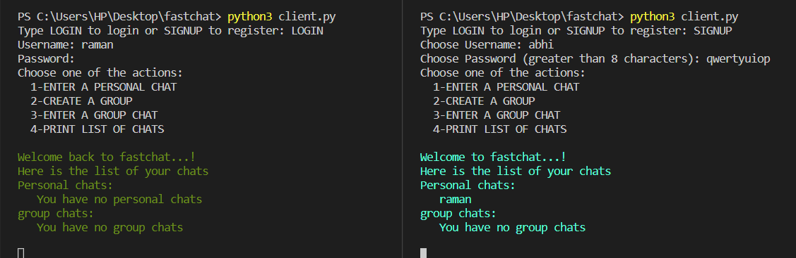
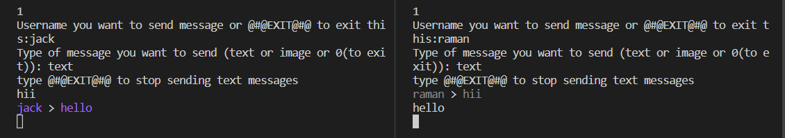
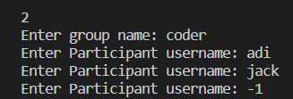
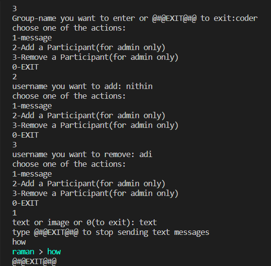

# FASTCHAT

### ✨HackStreet Boys✨

Our FastChat project is currently under progress. We have done the chatting part and the database part. Now we are working on the encryption and load balancing.

## Working Features

- Creates an account for a client and allows him to login at any time.
- Personal chat between two persons.
- Group creation, Group chat and Admin Powers.
- End to End Encryption of chat between Clients
- Load Balancing of servers

## Tech

- Python
- Postgres
- Socket Library 
- Threading
- Bcrypt Library

## Working

- server:
```sh
python3 server.py
```

### For Login/Signup..

- client:
```sh
python3 client.py
# Enter the username and password
```

In case of successful login/signup, the program will show the available clients and groups 

<!--  -->

### For Personal Chat between two persons...

Our program can send both text messages and images. 

```sh
Python3 client.py
# Login/Signup
# Input: @#@ENTER A PERSONAL CHAT@#@
# Input: Person name
# For text:
#   Input: message
# For Image:
#   Input: -1
#   Input: path to image
# For leaving
#   Input: @#@EXIT THIS CHAT-ROOM@#@
```
<!--  -->

If the receiver is offline then the message is stored in the database.

### For Group Creation...

```sh
Python3 client.py
# Login/Signup
# Input: @#@CREATE A GROUP@#@
# Input: Group name
# Input: Participant names
# Input: -1 to stop
```

<!--  -->


### For Group Chat...

```sh
Python3 client.py
# Login/Signup
# Input: @#@ENTER A GROUP CHAT@#@
# Input: Group name
# For Chatting
#   Input: @#@message@#@
#   Input: Messages
#   Input: @#@EXIT THIS CHAT-ROOM@#@ to stop
# For Adding a participant
#   Input: @#@Add a participant@#@
#   Output(if not an admin): Only admin can add/remove partipants
#   Input: Participant name
# For Removing a participant
#   Input: @#@Remove a participant@#@
#   Output(if not an admin): Only admin can add/remove partipants
#   Input: Participant name
# For leaving
#   Input: @#@EXIT THIS CHAT-ROOM@#@
```

<!--  -->

## Team Members Contribution

Members: Mohith, Nithin and Adhitya

Most of the work we have done in team and helped each other

Major contributions:
- Adithya: Personal Chat
- Mohith: Group Chat
- Nithin: DataBase
